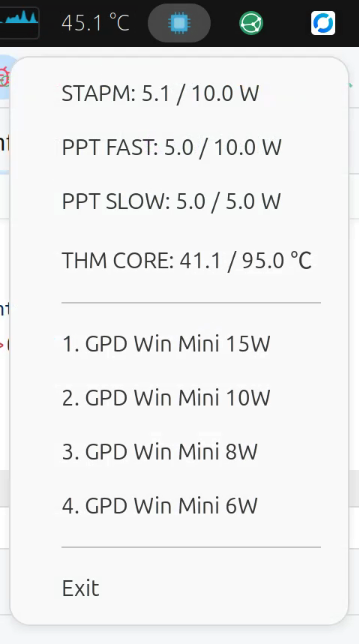

# RyzenAdj Indicator

`RyzenAdj Indicator` is a simple indicator for [RyzenAdj](https://github.com/FlyGoat/RyzenAdj), a tool to adjust the power and performance of AMD Ryzen processors. This indicator provides a graphical representation of the current power and performance settings of your Ryzen processor.



## Build

To build the project, you need to have the following dependencies installed:

```bash
sudo apt install cmake pkg-config build-essential libgtk-3-dev libayatana-appindicator3-dev libgtkmm-3.0-dev libpci-dev
```

To build the project, run the following commands:

```bash
mkdir build
cd build
cmake .. -DCMAKE_BUILD_TYPE=RelWithDebInfo
make -j$(nproc)
```

All required files are copied into the build directory. Since I haven't written the installation script yet, you need to package thous files manually. 

The following structure is required to run the program:

```
app
├── assets
│   ├── icon.png
├── RyzenAdjDaemon
├── RyzenAdjIndicator
├── config.json
```

- `RyzenAdjDaemon` is the daemon that runs in the background and communicates with the indicator. To communicate with the motherboard, it needs to be run with root privileges. 
- `RyzenAdjIndicator` is the indicator that runs in the system tray and displays the current power and performance settings of your Ryzen processor. It will automatically start / stop the daemon.
- `config.json` is the configuration file contains power setting profiles. You can add your own profiles to this file.

**Note**: Unexpected power settings may damage your hardware. Use at your own risk.

## License

Since `RyzenAdj` is licensed under the GPL-3.0 License, this project is also licensed under the GPL-3.0 License.

:)
